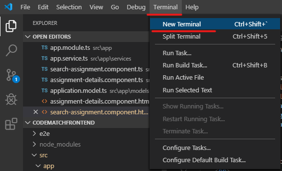
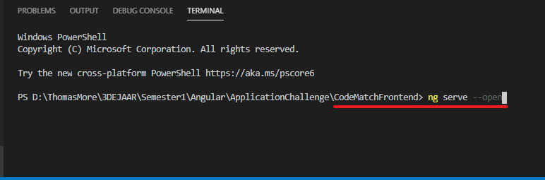

# Project 4.0: C2 E-ware

## Project descriptie

In deze repo kan je de sourcecode terugvinden van onze app die we maakten voor project 4.0. Project 4.0 is een groepsproject dat in het laatste jaar van de ITFactory plaastvind. De teams bestaan uit studenten van alle afstudeerrichtingen. Samen gaan de teams voor een klant een groot project maken. Lees gerust verder over hoe ons team dit aangepakt heeft.

## Team: E-ware (C2)

Deze opdracht is niet gemaakt door 1 student, maar door een team van studenten. Ons team, E-ware bestaat uit 5 leden.
  * Dries Janssen
  * Brecht Snoeck
  * Jeroen Laenen
  * Arne Van den Eynden
  * Sebastiaan Bergmans

## Wat zit er in deze?

In deze repository kan je de source code vinden van onze Ionic Angular applicatie. Om deze applicatie te openen zal je deze repo moeten clonen. Meer informatie kan je hieronder terugvinden.

## Installatie

Voordat u deze repo kloon / downloadt, wilt u misschien controleren of uw ontwikkelomgeving in orde is.

* Eerst heb je een IDE nodig. Persoonlijk gebruiken we Visual Studio Code graag. Maar andere IDE's zoals Webstorm, Angular IDE, Atom-editor, ... zijn goede keuzes. Als u VSC wilt downloaden, klikt u op de volgende link: https://code.visualstudio.com/

* Ten tweede heb je Node.js nodig (versie 10.9.0 of hoger). U kunt Node.js downloaden via de volgende link https://nodejs.org/en/. 
  * Na installatie kunt u uw huidige versie controleren met: voer ‘node -v’ uit in een terminal / console. 
  * Npm package manager wordt geïnstalleerd samen met Node.js. U kunt de huidige versie controleren met: voer 'npm -v' uit in terminal / console.

* Ten slotte werd dit project gegenereerd met de [Angular CLI] (https://github.com/angular/angular-cli) versie 8.1.1. Om er zeker van te zijn dat u het project kunt deployen, moet u de volgende opdracht uitvoeren om de Angular cli te installeren:

  * “npm install -g @angular/cli@8.1.1” in een terminal/console.

## Development

Om de applicatie te implementeren, kunt u de terminal in uw IDE gebruiken.

 
 
Voer `ng serve --open` uit voor een dev-server. Navigeer naar `http: // localhost: 4200 /`. De app wordt automatisch opnieuw geladen als u een van de bronbestanden wijzigt.

 
